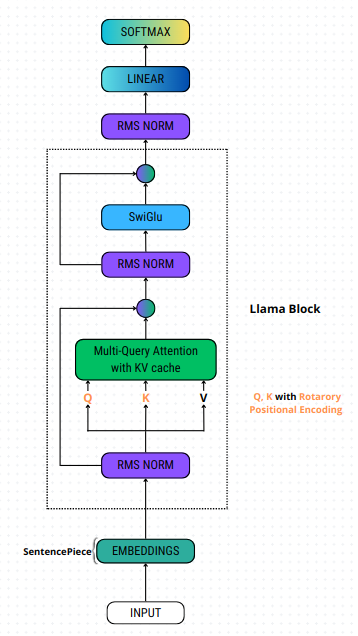

# LLAMA: Large Language Model Meta AI

Este repositório contém a implementação do modelo LLAMA (Large Language Model Meta AI) em PyTorch. A implementação foca no treinamento de um modelo transformer utilizando textos de Shakespeare. 

## Visão Geral

Este projeto fornece uma visão detalhada da implementação de um modelo de linguagem baseado em Transformer. Ele inclui o download e pré-processamento do dataset, definição da arquitetura do modelo, funções de treinamento, validação e teste.

## Arquitetura do Modelo

A arquitetura do modelo de linguagem LLAMA é uma variante do Transformer com várias modificações e otimizações. Os principais componentes incluem:

- **Embeddings**: Utiliza a técnica de SentencePiece para dividir o texto em subpalavras e mapear estas subpalavras para vetores de embeddings.
- **Rotary Positional Encoding**: Técnica de codificação posicional usada para incorporar informações sobre a posição dos tokens na sequência.
- **RMS Norm**: Técnica de normalização que utiliza a média quadrática dos valores.
- **Multi-Query Attention com KV Cache**: Variante da atenção multi-cabeça onde as chaves (K) e os valores (V) são armazenados em cache para eficiência.
- **SwiGLU**: Função de ativação composta por duas unidades lineares e uma operação de gating.
- **Llama Block**: Unidade de construção principal do modelo LLAMA.
- **Linear e Softmax**: Transformam a saída do último bloco LLAMA em probabilidades.




## Hiperparâmetros

Os principais hiperparâmetros utilizados no modelo são:

- **VOCAB_SIZE**: 130
- **BATCH_SIZE**: 32
- **CONTEXT_WINDOW**: 16
- **EPOCHS**: 1000
- **DIM**: 128
- **LOG_INTERVAL**: 10
- **HEADS**: 8
- **LAYERS**: 4
- **OTIMIZADOR**: Adam

## Resultados

Os resultados de validação e teste obtidos foram os seguintes:

### Validação
- **Perda de Validação (Validation Loss)**: 4.469351182460785
- **Acurácia de Validação (Validation Accuracy)**: 0.05590234375
- **Perplexidade de Validação (Validation Perplexity)**: 87.31600547944738

### Teste
- **Acurácia de Teste (Test Accuracy)**: 0.056173828125
- **Perplexidade de Teste (Test Perplexity)**: 87.69882926177978

## Requisitos

Para executar este projeto, você precisará das seguintes bibliotecas:

```bash
%pip install sentencepiece
%pip install pandas
%pip install numpy
%pip install requests
%pip install torch
%pip install transformers
%pip install fairscale
```
- Matheus Palheta - matheus.palheta@icomp.ufam.edu.br
- Instituto de Computação, Universidade Federal do Amazonas (UFAM)
